# Sistema de Gestión de Personal — Diseño técnico (Fase 1)

Versión 1.0 · 06/10/2026 · Estado: **aprobado el 06/10/2026** con las recomendaciones de la sección 10; repositorio: poncio16/RRHHPP

Este documento cubre la Fase 1 pedida en la sección 43: análisis de requerimientos, contradicciones y riesgos, mejoras, arquitectura, modelo de datos, estructura de carpetas y plan de fases. No se escribió código de la aplicación. Las decisiones que necesitan aprobación están marcadas con **[DECISIÓN]** y resumidas en la sección 10.

---

## 1. Resumen ejecutivo

- **Aplicación monolítica Next.js (App Router)** con capa de servicios y repositorios dentro del mismo proyecto. Sin microservicios.
- **PostgreSQL + Prisma**, IDs UUID v7, fechas de calendario como `DATE`, instantes como `TIMESTAMPTZ`, importes como `NUMERIC(14,2)`.
- **Toda regla legal o convencional es un parámetro** (días de vacaciones por antigüedad, modo de conteo de días, tolerancias, anticipación de alertas, rangos de antigüedad). El sistema trae valores iniciales editables, nunca constantes en el código.
- **Autorización por permisos** (no solo por rol), verificada en el servidor en cada operación. Los 4 roles pedidos son conjuntos de permisos editables por el administrador.
- **Dos registros distintos de "qué pasó"**: el _historial laboral_ (dato de negocio, con fecha efectiva) y la _auditoría_ (bitácora técnica inmutable de quién hizo qué).
- **Baja lógica siempre**. El egreso no borra el legajo; el reingreso reutiliza el mismo legajo.
- **Remuneraciones = registro administrativo informado**, rotulado explícitamente como "no constituye liquidación de haberes".

---

## 2. Análisis de requerimientos: contradicciones, omisiones y riesgos

### 2.1 Contradicciones o superposiciones

| #   | Hallazgo                                                                                                                                                                                                                                                                                           | Propuesta                                                                                                                                                                                                                                                                                                                                                                                                                |
| --- | -------------------------------------------------------------------------------------------------------------------------------------------------------------------------------------------------------------------------------------------------------------------------------------------------- | ------------------------------------------------------------------------------------------------------------------------------------------------------------------------------------------------------------------------------------------------------------------------------------------------------------------------------------------------------------------------------------------------------------------------ |
| C1  | "Vacaciones" aparece como tipo de licencia (§8) y como módulo propio (§7). Además §23 pide entidades separadas `Leave`, `Absence` y `Vacation`. Tres tablas con fechas desde/hasta duplican lógica (solapamientos, conteo de días, aprobación) y obligan a consultar tres fuentes para ausentismo. | **[DECISIÓN]** Una sola entidad de movimiento, `LeaveRecord` ("licencia/ausencia"), cuyo `LeaveType` tiene una _clase_: `LICENCIA`, `AUSENCIA`, `VACACIONES`, `SUSPENSION`. El módulo de Vacaciones es una vista especializada sobre los registros de clase `VACACIONES` más el **saldo anual** (`VacationBalance`). En la interfaz siguen existiendo los tres módulos separados. Cumple §23 ("entidades equivalentes"). |
| C2  | Ausencias, llegadas tarde, horas extras, cambios de categoría y cambios salariales se piden en Asistencia/Licencias/Legajo/Remuneraciones **y** otra vez en Novedades. Cargar dos veces el mismo hecho genera inconsistencias.                                                                     | **[DECISIÓN]** Cada hecho se registra en su módulo de origen. Novedades es la "bandeja hacia liquidación": algunas se cargan a mano (adelantos, premios, descuentos, sanciones) y otras se **generan automáticamente** desde el módulo de origen con un vínculo (`sourceType`/`sourceId`), para no cargar dos veces.                                                                                                     |
| C3  | El estado del empleado es activo/suspendido/egresado (§4), pero el dashboard pide "inactivos" (§3).                                                                                                                                                                                                | **[DECISIÓN]** "Inactivos" = egresados. Los suspendidos se muestran como indicador separado (siguen en dotación).                                                                                                                                                                                                                                                                                                        |
| C4  | "Suspendido" como estado guardado a mano y "suspensiones" como historial con fechas son dos fuentes de verdad. Si se carga una suspensión del 10 al 15, alguien tendría que acordarse de cambiar el estado el 10 y el 16.                                                                          | Se guarda `status` = `ACTIVO` / `EGRESADO`. "Suspendido" se **deriva**: activo con un registro de clase `SUSPENSION` aprobado que cubre la fecha consultada. Los filtros y el dashboard lo calculan por consulta.                                                                                                                                                                                                        |
| C5  | Orden de fases (§37): el Legajo (Fase 4) necesita sectores, puestos y categorías, que se crean en la Fase 5. La Auditoría está en la Fase 14 pero el login (Fase 3) ya debe auditarse.                                                                                                             | Se intercambian las Fases 4 y 5. La **infraestructura** de auditoría (escritura) entra en la Fase 3 y cada módulo audita desde el día uno; la Fase 14 queda para el visor de auditoría. Ver sección 9.                                                                                                                                                                                                                   |
| C6  | §7 pide "solicitar vacaciones" y "aprobar/rechazar", pero los empleados no son usuarios del sistema (el portal del empleado es una integración futura, §41).                                                                                                                                       | Las solicitudes las carga RRHH en nombre del empleado y las aprueba un usuario con permiso de aprobación. El modelo ya guarda `requestedById`/`decidedById` para que el futuro portal se enchufe sin migrar datos.                                                                                                                                                                                                       |
| C7  | ART y Obra social se piden por empleado. La ART normalmente la contrata el empleador para toda la nómina.                                                                                                                                                                                          | Se mantiene por empleado (lo pide el prompt) pero con **valor predeterminado de la empresa** en Configuración, así no se carga 20 veces.                                                                                                                                                                                                                                                                                 |
| C8  | §11 mezcla dos conceptos: la _condición salarial pactada_ (básico vigente y sus cambios) y el _resumen mensual informado_ por el sistema de liquidación (bruto, descuentos, neto de un período).                                                                                                   | Dos entidades: `SalaryHistory` (condición con fecha efectiva, genera "cambios salariales") y `PayrollRecord` (resumen informado por período con renglones de conceptos).                                                                                                                                                                                                                                                 |

### 2.2 Omisiones que conviene cubrir (necesarias para que lo pedido funcione)

| #   | Omisión                               | Por qué hace falta                                                                                                                     | Propuesta                                                                                                                                                                                                                                                                              |
| --- | ------------------------------------- | -------------------------------------------------------------------------------------------------------------------------------------- | -------------------------------------------------------------------------------------------------------------------------------------------------------------------------------------------------------------------------------------------------------------------------------------- |
| O1  | **Feriados**                          | Sin calendario de feriados no se pueden contar días hábiles (vacaciones/licencias según convenio) ni detectar ausencias en asistencia. | Tabla `Holiday` administrable. No se precarga ningún calendario oficial como verdad: se carga desde Configuración (el seed incluye ejemplos marcados como tales).                                                                                                                      |
| O2  | **Reingreso**                         | `DNI` y `CUIL` son únicos; un empleado que vuelve no podría darse de alta.                                                             | Reingreso sobre el **mismo legajo**: nuevo período laboral, el egreso anterior queda en historial. Se agrega **fecha de antigüedad reconocida** (`seniorityDate`), editable, distinta de la fecha de ingreso, porque el cómputo de períodos anteriores depende de cada caso.           |
| O3  | **Concurrencia**                      | Dos usuarios editando el mismo legajo: el segundo pisa al primero sin aviso (incumple criterio 28).                                    | Bloqueo optimista con campo `version`: si el registro cambió desde que se abrió, se avisa y no se guarda.                                                                                                                                                                              |
| O4  | **Almacenamiento de archivos**        | §6 dice "cuando la arquitectura lo permita". Hay que decidir dónde viven los archivos.                                                 | Capa `storage` con un driver de **disco local** (volumen persistente) en V1 y la interfaz preparada para un driver S3-compatible. Los archivos **nunca** son públicos: se descargan por una ruta autenticada que verifica permisos y audita la descarga. Depende del hosting (ver O5). |
| O5  | **Hosting / despliegue**              | Define si el disco local es viable, cómo se hacen backups y el costo.                                                                  | **[DECISIÓN]** Recomendado: Docker Compose (app + PostgreSQL) en un VPS o servidor propio. Alternativa: Vercel + Postgres gestionado + almacenamiento S3 (más servicios, archivos fuera del disco).                                                                                    |
| O6  | **Backups**                           | Información sensible y legalmente relevante; no está pedido.                                                                           | Documentar `pg_dump` programado + copia del volumen de archivos, con prueba de restauración. Solo documentación y script, sin servicios extra.                                                                                                                                         |
| O7  | **Datos de salud**                    | Certificados médicos y preocupacionales son _datos sensibles_ (Ley 25.326 de Protección de Datos Personales).                          | Los tipos de documento y de licencia tienen la marca `sensitive`. Solo los ven roles con permiso específico. Las descargas se auditan.                                                                                                                                                 |
| O8  | **Política de contraseñas y bloqueo** | §18 pide control de sesiones pero no define bloqueo por intentos ni expiración.                                                        | Bloqueo temporal tras N intentos fallidos, expiración por inactividad y absoluta, cierre de sesión remoto por el administrador. Todo parametrizable.                                                                                                                                   |
| O9  | **Definición de "ausentismo"**        | El indicador del dashboard no tiene fórmula.                                                                                           | Ausentismo = días de ausencia de tipos marcados `countsForAbsenteeism` / días laborables teóricos del período × 100. Qué tipos cuentan se configura por tipo.                                                                                                                          |
| O10 | **"Legajo incompleto"**               | §28 pide alerta pero no define qué es incompleto.                                                                                      | Lista configurable de campos requeridos para considerar el legajo completo (además de los obligatorios para guardar).                                                                                                                                                                  |
| O11 | **Turnos que cruzan medianoche**      | Un turno 22:00–06:00 rompe el cálculo si se guardan solo horas.                                                                        | Entrada y salida se guardan como fecha-hora completa; el día de asistencia es el día de inicio del turno.                                                                                                                                                                              |
| O12 | **Número de legajo**                  | No se define si es manual o automático.                                                                                                | Se sugiere el siguiente número automáticamente y se puede editar; único.                                                                                                                                                                                                               |

### 2.3 Riesgos

| Riesgo                                                                                                    | Mitigación                                                                                                                                                                                   |
| --------------------------------------------------------------------------------------------------------- | -------------------------------------------------------------------------------------------------------------------------------------------------------------------------------------------- |
| Alcance muy amplio (16 fases, ~25 entidades) para una V1.                                                 | Fases cortas, cada una en un Pull Request que compila, pasa tests y se puede probar. Nada se marca como terminado si no persiste en la base.                                                 |
| Presentar valores salariales como si fueran liquidación.                                                  | Rótulo fijo "Información informada — no constituye liquidación de haberes" en pantallas y exportaciones de remuneraciones. Sin cálculos de aportes/contribuciones.                           |
| Valores legales precargados que queden desactualizados o sean incorrectos para el convenio de la empresa. | Todos los valores iniciales se muestran como "a validar" en Configuración. **[DECISIÓN]** si se precargan los valores de referencia de la LCT o se dejan vacíos.                             |
| Fugas de datos sensibles (CBU, salarios, salud) por listados o exportaciones.                             | Selección de campos por permiso en la capa de servicios (no en la UI), listados sin datos sensibles, exportaciones auditadas, enmascarado de CBU en auditoría.                               |
| Bypass de autorización vía middleware (caso CVE-2025-29927 de Next.js).                                   | El middleware solo redirige; la verificación real de sesión y permisos ocurre en cada server action, route handler y servicio.                                                               |
| Errores de zona horaria en fechas (corrimiento de un día).                                                | Fechas de calendario como `DATE` (sin hora). Instantes como `TIMESTAMPTZ`. Conversión a `America/Argentina/Buenos_Aires` (configurable) solo en presentación.                                |
| Importación masiva que pise datos existentes.                                                             | La importación solo **crea**; un registro que coincide por DNI/CUIL/legajo se informa como duplicado y no se toca. Previsualización obligatoria antes de confirmar, todo en una transacción. |

---

## 3. Mejoras propuestas (dentro del alcance, sin funcionalidades nuevas)

1. **Línea de tiempo del legajo**: una pestaña "Historial" que une cambios laborales, salariales, licencias, suspensiones, egresos y reingresos en orden cronológico (lee de las tablas existentes, no duplica datos).
2. **Generación anual de saldos de vacaciones**: acción "Generar períodos {año}" que calcula los días que corresponden a cada empleado según las reglas configuradas, con previsualización y ajuste manual justificado.
3. **Cálculo de días con modo configurable**: cada tipo de licencia define si cuenta días corridos o hábiles; los hábiles usan los días laborables del horario del empleado y el calendario de feriados.
4. **Validación de solapamientos**: no se pueden aprobar dos licencias/ausencias que se superpongan para el mismo empleado.
5. **Auditoría inmutable a nivel base de datos**: un trigger de PostgreSQL impide `UPDATE`/`DELETE` sobre la tabla de auditoría.
6. **Catálogos con desactivación** en lugar de borrado: un sector usado por empleados no se borra, se desactiva y deja de ofrecerse en los formularios.

---

## 4. Arquitectura

### 4.1 Stack y versiones

| Capa                | Elección                                                                                   | Motivo                                                                        |
| ------------------- | ------------------------------------------------------------------------------------------ | ----------------------------------------------------------------------------- |
| Runtime             | Node.js LTS vigente (24.x)                                                                 | Soporte largo.                                                                |
| Framework           | Next.js estable vigente, App Router, React Server Components                               | Obligatorio.                                                                  |
| Lenguaje            | TypeScript `strict` + `noUncheckedIndexedAccess`                                           | Obligatorio.                                                                  |
| Estilos             | Tailwind CSS v4                                                                            | Obligatorio.                                                                  |
| Componentes UI      | shadcn/ui (Radix UI, código copiado al repo)                                               | Accesibles, sin dependencia de una librería cerrada, se adaptan con Tailwind. |
| Tablas              | TanStack Table (paginación, orden y filtros **en servidor**)                               | Estándar, sin estilos propios.                                                |
| Formularios         | React Hook Form + Zod (mismo esquema en cliente y servidor)                                | Validación doble sin duplicar reglas.                                         |
| Gráficos            | Recharts                                                                                   | Simple, suficiente para barras/tortas/líneas.                                 |
| Fechas              | date-fns + @date-fns/tz                                                                    | Liviano, manejo explícito de zona horaria.                                    |
| Base de datos       | PostgreSQL 16 o superior                                                                   | Obligatorio. Extensiones `pg_trgm` y `unaccent` para búsqueda.                |
| ORM                 | Prisma (estable vigente), migraciones con `prisma migrate`                                 | Obligatorio.                                                                  |
| Hash de contraseñas | Argon2id (`@node-rs/argon2`)                                                               | Recomendación OWASP vigente; binarios precompilados.                          |
| Excel/CSV           | ExcelJS (lectura y escritura de .xlsx y .csv)                                              | Una sola librería para importar y exportar.                                   |
| Logs                | pino (JSON estructurado)                                                                   | Liviano; separa logs técnicos de la auditoría de negocio.                     |
| Tests               | Vitest (unitarios e integración contra PostgreSQL real), Playwright (pocos flujos de humo) | Rápido; integración real sin mocks de base.                                   |
| Calidad             | ESLint, Prettier, `tsc --noEmit`, GitHub Actions en cada PR                                | Criterio de "compila y pasa tests" automatizado.                              |

Las versiones exactas se fijan en la Fase 2 con las estables de ese momento.

### 4.2 Capas y flujo de una operación

```
 Navegador
   │  (formularios RHF+Zod, tablas, gráficos)
   ▼
 app/ (páginas RSC, layouts)          ← solo presentación y composición
   │
   ├─ Server Actions (features/*/actions.ts)   ← mutaciones desde la UI
   └─ Route Handlers (app/api/**)              ← descargas, subidas, exportaciones,
   │                                              importación, futura API externa
   ▼
 Adaptador común: requireSession() → requirePermission() → schema.parse()
   │
   ▼
 Servicios (features/*/service.ts)    ← reglas de negocio, transacciones,
   │                                     historial, auditoría, selección de campos por permiso
   ▼
 Repositorios (features/*/repository.ts) ← único lugar con consultas Prisma
   ▼
 PostgreSQL
```

Reglas:

- Los componentes no contienen lógica de negocio ni llaman a Prisma.
- Los servicios reciben un `ctx` (usuario, permisos, IP, request id) y son el **único** punto de entrada a la lógica; server actions y route handlers son adaptadores finos. La futura API externa (§41) reutiliza los mismos servicios.
- Cada servicio que modifica datos abre una transacción que incluye el cambio, el historial laboral y el registro de auditoría: o se guarda todo o nada.
- Las lecturas de páginas se hacen en Server Components llamando a servicios de consulta (sin endpoint intermedio).

### 4.3 Manejo de errores

- Jerarquía `AppError`: `ValidationError` (con errores por campo), `NotFoundError`, `ForbiddenError`, `UnauthorizedError`, `ConflictError` (duplicados, versión desactualizada), `BusinessRuleError`.
- Errores de Prisma conocidos se traducen (p. ej. violación de unicidad → `ConflictError` "Ya existe un empleado con ese DNI").
- Server actions devuelven `{ ok: true, data } | { ok: false, error: { code, message, fieldErrors? } }`; los route handlers, el mismo cuerpo con su código HTTP.
- Errores inesperados: se registran en log con `requestId` y al usuario se le muestra un mensaje genérico en español con ese código de referencia, sin detalles internos.
- `error.tsx` y `not-found.tsx` por sección; los formularios conservan lo cargado ante un error (criterio 28).

### 4.4 Autenticación y sesiones

- Login con email y contraseña. Implementación propia mínima y auditable (en vez de Auth.js, cuyo proveedor de credenciales no ofrece sesiones revocables en base de datos sin trabajo extra):
  - Sesión en tabla `Session`; la cookie lleva un token aleatorio de 256 bits, en base se guarda solo su hash SHA-256.
  - Cookie `HttpOnly`, `Secure`, `SameSite=Lax`.
  - Expiración por inactividad y absoluta (parámetros), renovación deslizante.
  - Cierre de sesión, cierre de todas las sesiones de un usuario por el administrador, invalidación al cambiar contraseña o desactivar usuario.
  - Bloqueo temporal tras N intentos fallidos (parámetro), registro en auditoría de éxitos y fallos con IP.
  - Contraseña inicial con cambio obligatorio en el primer ingreso; política mínima de longitud parametrizable.
- Recuperación de contraseña por email: **no** en V1 (no hay servicio de email); el administrador restablece la contraseña. Queda preparado para cuando se agreguen notificaciones por email (§41).

### 4.5 Autorización

- Catálogo de **permisos** definido en código (son capacidades del software), p. ej. `employee:read`, `employee:write`, `employee.personal:read`, `employee.bank:read`, `salary:read`, `salary:write`, `document:read`, `document.sensitive:read`, `leave:approve`, `report:headcount`, `audit:read`, `user:manage`, `config:manage`.
- **Roles** en base con su conjunto de permisos (`RolePermission`), editable por el administrador; los cambios se auditan. Los 4 roles se crean en el seed y están protegidos contra borrado.
- Verificación en el servidor en tres niveles: acceso a la operación, alcance de campos (un usuario sin `employee.bank:read` recibe el empleado **sin** datos bancarios desde el servicio) y acceso al archivo.
- La UI oculta lo que no se puede hacer solo por comodidad; nunca es la barrera.

Matriz inicial propuesta **[DECISIÓN]**:

| Área                                                                     |    Administrador    |        RRHH         |                        Administración                         | Consulta |
| ------------------------------------------------------------------------ | :-----------------: | :-----------------: | :-----------------------------------------------------------: | :------: |
| Empleados: datos generales (nombre, legajo, sector, puesto, estado)      |      Escritura      |      Escritura      |                            Lectura                            | Lectura  |
| Empleados: datos personales (DNI, CUIL, domicilio, nacimiento, contacto) |      Escritura      |      Escritura      |                            Lectura                            |    —     |
| Datos bancarios                                                          |      Escritura      |      Escritura      |                            Lectura                            |    —     |
| Remuneraciones e historial salarial                                      |      Escritura      |      Escritura      |                            Lectura                            |    —     |
| Novedades                                                                |      Escritura      |      Escritura      |                 Lectura + marcar "informada"                  |    —     |
| Documentación general                                                    |      Escritura      |      Escritura      |                            Lectura                            |    —     |
| Documentación sensible (médica, preocupacional)                          |      Escritura      |      Escritura      |                               —                               |    —     |
| Licencias, ausencias, vacaciones (registrar / aprobar)                   | Escritura + aprobar | Escritura + aprobar |                            Lectura                            | Lectura  |
| Asistencia y horarios                                                    |      Escritura      |      Escritura      |                            Lectura                            | Lectura  |
| Egresos                                                                  |      Escritura      |      Escritura      |                            Lectura                            |    —     |
| Reportes                                                                 |        Todos        |        Todos        | Dotación, altas/bajas, ausentismo, vacaciones, remuneraciones | Dotación |
| Importación                                                              |         Sí          |         Sí          |                               —                               |    —     |
| Exportación                                                              |         Sí          |         Sí          |                    De los reportes que ve                     |    —     |
| Configuración y catálogos                                                |        Todo         |  Catálogos de RRHH  |                               —                               |    —     |
| Usuarios, roles y permisos                                               |         Sí          |          —          |                               —                               |    —     |
| Visor de auditoría                                                       |         Sí          |          —          |                               —                               |    —     |
| Borrado físico                                                           |  Sí (restringido)   |          —          |                               —                               |    —     |

### 4.6 Seguridad (resumen de controles)

- Validación Zod en servidor de **toda** entrada (cuerpo, parámetros de URL, filtros); el cliente valida además por experiencia de uso.
- Prisma con consultas parametrizadas; sin SQL crudo salvo reportes puntuales con `Prisma.sql` parametrizado.
- React escapa la salida; no se usa `dangerouslySetInnerHTML`.
- Server actions verifican origen (protección CSRF incorporada de Next.js); los route handlers que modifican datos verifican `Origin`.
- Cabeceras de seguridad: CSP, `X-Content-Type-Options`, `Referrer-Policy`, `Frame-Options`, HSTS en producción.
- Archivos: lista blanca de tipos (PDF, JPG, PNG, y los que se configuren), tamaño máximo parametrizable, verificación del tipo real por contenido, nombre interno aleatorio, hash SHA-256, descarga con `Content-Disposition: attachment`.
- Secretos solo por `.env` (validados al arrancar con Zod: la app no inicia si falta uno); `.env.example` sin valores reales.
- Logs sin contraseñas, tokens ni CBU completos.
- Usuario de base de datos de la aplicación sin permisos de superusuario.

### 4.7 Auditoría

- Servicio `audit.record(ctx, {...})` llamado dentro de la misma transacción que la operación.
- Guarda solo el **diff** (campos modificados, antes/después), con campos sensibles enmascarados (CBU → `****1234`, contraseñas nunca).
- También registra intentos denegados (`result = DENIED`), inicios de sesión fallidos, exportaciones, importaciones y descargas de archivos sensibles.
- Inmutable: trigger que rechaza `UPDATE`/`DELETE` en `audit_log`.
- La IP se toma de `x-forwarded-for` solo si se configura un proxy de confianza.

### 4.8 Alertas

- Las alertas se **calculan por consulta** (documentos que vencen dentro de N días, licencias que terminan, vacaciones que empiezan, cumpleaños, saldos de vacaciones sin usar, legajos incompletos) con la anticipación configurada por tipo.
- Una tabla `AlertDismissal` guarda las alertas descartadas o pospuestas, para que "pendientes" tenga sentido.
- Sin tareas programadas ni servicio de email en V1; el diseño permite agregar luego un job diario que envíe las mismas alertas por email.

### 4.9 Preparación para integraciones futuras (sin implementarlas)

| Integración                      | Punto de extensión previsto                                                                                       |
| -------------------------------- | ----------------------------------------------------------------------------------------------------------------- |
| Sistema de liquidación           | `PayrollRecord.source` (`MANUAL`/`IMPORT`/`API`), novedades con estado `INFORMADA` y exportación por período.     |
| Reloj de fichada                 | `AttendanceDay.source` y `externalRef`; la tabla de marcaciones crudas se agrega cuando exista el reloj concreto. |
| API externa / ERP / contabilidad | Servicios independientes de la UI; se exponen como `app/api/v1/**` con tokens de API.                             |
| Portal del empleado              | `User.employeeId` opcional; solicitudes de licencia con `requestedById`.                                          |
| Recibos digitales / firma        | `Document` + `StoredFile` con hash, listo para asociar firma.                                                     |
| Email / WhatsApp                 | Alertas calculadas por un servicio reutilizable desde un job.                                                     |
| Almacenamiento en la nube        | Interfaz `StorageDriver` (`put/get/delete`) con driver local en V1.                                               |

---

## 5. Modelo de datos

### 5.1 Convenciones

- Tablas en `snake_case` (vía `@@map`), modelos Prisma en inglés `PascalCase`, etiquetas de interfaz en español.
- `id UUID` generado como **UUID v7** (ordenable en el tiempo, buen comportamiento en índices).
- Todas las tablas: `created_at`, `updated_at`; las de negocio también `created_by_id`, `updated_by_id`.
- Fechas de calendario (`birth_date`, `hire_date`, `start_date`…) como `DATE`. Instantes como `TIMESTAMPTZ`.
- Importes `NUMERIC(14,2)`; nunca `float`. Minutos de asistencia como enteros.
- Catálogos con `is_active` y `sort_order`; no se borran si están en uso (FK `ON DELETE RESTRICT`).
- Enums de Postgres solo para estados que el código interpreta (no editables). Todo lo que el usuario puede administrar es tabla.
- Restricciones `CHECK` en la base para lo que nunca debe romperse (`end_date >= start_date`, importes ≥ 0 donde corresponda, `exit_date >= hire_date`).

### 5.2 Diagrama de relaciones (núcleo)

```mermaid
erDiagram
  User }o--|| Role : tiene
  Role ||--o{ RolePermission : otorga
  User ||--o{ Session : abre
  User |o--o| Employee : "portal futuro"

  Employee }o--|| Department : sector
  Employee }o--|| Position : puesto
  Employee }o--o| Category : categoria
  Category }o--o| CollectiveAgreement : convenio
  Employee }o--|| ContractType : contratacion
  Employee }o--o| WorkdayType : jornada
  Employee }o--o| WorkSchedule : horario
  Employee }o--|| Workplace : establecimiento
  Employee }o--o| Employee : superior
  Employee }o--o| HealthInsurer : obra_social
  Employee }o--o| ArtProvider : art
  Employee ||--o| EmployeeBankAccount : banco

  Employee ||--o{ EmployeeChangeHistory : historial
  Employee ||--o{ SalaryHistory : salario
  Employee ||--o{ PayrollRecord : informado
  PayrollRecord ||--o{ PayrollRecordLine : conceptos
  Employee ||--o{ LeaveRecord : licencias
  LeaveRecord }o--|| LeaveType : tipo
  LeaveRecord }o--o| VacationBalance : imputa
  Employee ||--o{ VacationBalance : saldos
  Employee ||--o{ AttendanceDay : asistencia
  Employee ||--o{ Document : documentos
  Document }o--|| DocumentType : tipo
  Document }o--o| StoredFile : archivo
  Employee ||--o{ Novelty : novedades
  Novelty }o--|| NoveltyType : tipo
  Employee ||--o{ EmployeeExit : egresos
  WorkSchedule ||--o{ WorkScheduleDay : dias
```



### 5.3 Entidades

Notación: `?` = opcional, `U` = único, `FK` = clave foránea, `IX` = índice.

#### Seguridad

**User** — `id`, `email` U, `name`, `password_hash`, `role_id` FK, `is_active`, `must_change_password`, `failed_login_count`, `locked_until?`, `last_login_at?`, `employee_id?` FK U (portal futuro).

**Role** — `id`, `code` U (`ADMIN`, `RRHH`, `ADMINISTRACION`, `CONSULTA`), `name`, `description?`, `is_system` (no borrable).

**RolePermission** — `role_id` FK, `permission` (código del catálogo en código). PK compuesta.

**Session** — `id`, `token_hash` U, `user_id` FK IX, `created_at`, `last_seen_at`, `expires_at`, `ip?`, `user_agent?`, `revoked_at?`.

#### Empresa y configuración

**Company** (fila única) — `id`, `legal_name`, `trade_name?`, `cuit`, domicilio, `province_id` FK, `timezone` (inicial `America/Argentina/Buenos_Aires`), `default_art_provider_id?`, `default_workplace_id?`.

**Setting** (equivale a `Configuration`) — `key` PK, `value` JSONB, `description`, `updated_by_id`, `updated_at`. Cada clave tiene un esquema Zod en código que valida el valor. Ejemplos: anticipación de alertas por tipo, tolerancia de llegada tarde, expiración de sesión, intentos de login, rangos de antigüedad para el reporte, fecha de corte para antigüedad de vacaciones, campos requeridos para "legajo completo", tamaño máximo de archivos.

**Province** — `id`, `code` U, `name`. Seed con las 24 jurisdicciones (dato estable).

**Holiday** — `id`, `date` U, `name`, `is_non_working_optional` (día no laborable optativo). Administrable.

**LookupValue** — `id`, `group`, `code`, `label`, `is_active`, `sort_order`; U(`group`,`code`). Listas simples sin atributos propios: estado civil, nacionalidad, modalidad de trabajo, tipo de cuenta bancaria, tipo de egreso, motivo de egreso. Evita una tabla por cada lista de dos columnas.

#### Estructura organizacional (catálogos con atributos)

| Entidad                                  | Campos propios                                                                                                                       |
| ---------------------------------------- | ------------------------------------------------------------------------------------------------------------------------------------ |
| **Department** (sector)                  | `name` U, `code?`                                                                                                                    |
| **Position** (puesto)                    | `name` U, `department_id?` (sector sugerido)                                                                                         |
| **CollectiveAgreement** (convenio)       | `name`, `number?` U, `union_name?`                                                                                                   |
| **Category**                             | `name`, `agreement_id?` FK; U(`agreement_id`,`name`)                                                                                 |
| **Workplace** (sucursal/establecimiento) | `name` U, domicilio, `province_id` FK                                                                                                |
| **ContractType**                         | `name` U, `has_end_date` (exige fecha de fin, p. ej. plazo fijo)                                                                     |
| **WorkdayType** (jornada)                | `name` U (completa, parcial…), `weekly_hours` NUMERIC                                                                                |
| **WorkSchedule** (horario/turno)         | `name` U, `weekly_hours`, `work_modality_id?`                                                                                        |
| **WorkScheduleDay**                      | `schedule_id` FK, `day_of_week` (1–7), `start_time`, `end_time`, `break_minutes`, `crosses_midnight`; U(`schedule_id`,`day_of_week`) |
| **HealthInsurer** (obra social)          | `name`, `rnos_code?` U                                                                                                               |
| **ArtProvider**                          | `name` U                                                                                                                             |
| **Bank**                                 | `name`, `code` U (3 dígitos, valida el CBU)                                                                                          |

Todas con `is_active`, `sort_order`, timestamps.

#### Legajo

**Employee**

- Identificación: `id`, `file_number` (legajo) U, `last_name`, `first_name`, `dni` U, `cuil` U, `birth_date`, `nationality_id?` FK LookupValue, `marital_status_id?` FK, `sex` (enum `F`/`M`/`X`, según DNI).
- Contacto: `address_line`, `city`, `province_id` FK, `postal_code`, `phone?`, `email?`, `emergency_contact_name?`, `emergency_contact_phone?`.
- Laborales: `hire_date`, `seniority_date` (antigüedad reconocida, inicia igual a `hire_date`), `contract_end_date?`, `exit_date?`, `status` (enum `ACTIVO`/`EGRESADO`), `department_id`, `position_id`, `category_id?`, `contract_type_id`, `workday_type_id?`, `work_schedule_id?`, `work_modality_id?`, `agreement_id?`, `health_insurer_id?`, `art_provider_id?`, `workplace_id`, `supervisor_id?` FK Employee.
- Control: `version` (bloqueo optimista), auditoría de usuario/fechas.
- Índices: `status`, `department_id`, `position_id`, `workplace_id`, `hire_date`; índice trigram sobre `unaccent(last_name || ' ' || first_name)` para búsqueda; `dni`, `cuil`, `file_number` ya únicos.
- CHECK: `exit_date IS NULL OR exit_date >= hire_date`.

**EmployeeBankAccount** (1:1, separada para controlar el acceso) — `employee_id` FK U, `bank_id` FK, `cbu` (22 dígitos), `alias?`, `account_type_id` FK LookupValue.

**EmployeeChangeHistory** (historial laboral)

- `id`, `employee_id` FK IX, `change_set_id` (agrupa campos cambiados en una misma operación), `change_type` (enum: `PUESTO`, `SECTOR`, `CATEGORIA`, `JORNADA`, `HORARIO`, `MODALIDAD`, `ESTABLECIMIENTO`, `CONTRATACION`, `CONVENIO`, `SUPERIOR`, `DATOS_BANCARIOS`, `REINGRESO`, `OTRO`), `field`, `old_value?`, `new_value?` (texto legible), `old_ref_id?`, `new_ref_id?` (ID del catálogo), `effective_date`, `notes?`, `created_by_id`, `created_at`.
- Se escribe automáticamente desde el servicio de empleados cuando cambia un campo histórico; la pantalla de edición pide fecha efectiva y observaciones para esos campos.
- Los cambios salariales, licencias, suspensiones y egresos no se copian acá: la línea de tiempo los lee de sus tablas.
- En V1 la fecha efectiva puede ser pasada o de hoy (el cambio se aplica al guardar). Los cambios programados a futuro quedan fuera de V1.

#### Remuneraciones

**SalaryConceptType** — `name` U, `nature` (enum `HABER`/`DESCUENTO`/`INFORMATIVO`), `kind` (enum `BASICO`, `ADICIONAL`, `BONIFICACION`, `PREMIO`, `HORAS_EXTRAS`, `OTRO`).

**SalaryHistory** (condición salarial pactada) — `id`, `employee_id` FK IX, `effective_date`, `basic_salary` NUMERIC ≥ 0, `notes?`, `created_by_id`. U(`employee_id`,`effective_date`). El básico vigente es el de mayor fecha efectiva ≤ hoy.

**PayrollRecord** (resumen informado por el sistema de liquidación) — `id`, `employee_id` FK, `period` (primer día del mes, `DATE`), `source` (enum `MANUAL`/`IMPORT`), `gross_reported`, `deductions_reported`, `net_reported` (NUMERIC ≥ 0), `notes?`. U(`employee_id`,`period`). Validación blanda: avisa si bruto − descuentos ≠ neto, sin bloquear (el dato viene de otro sistema).

**PayrollRecordLine** — `payroll_record_id` FK, `concept_type_id` FK, `description?`, `quantity?`, `amount` NUMERIC.

#### Licencias, ausencias y vacaciones

**LeaveType** — `id`, `name` U, `class` (enum `LICENCIA`/`AUSENCIA`/`VACACIONES`/`SUSPENSION`), `counting_mode` (enum `CORRIDOS`/`HABILES`), `is_paid`, `requires_certificate`, `max_days_per_event?`, `max_days_per_year?` (avisos configurables, no bloqueos rígidos), `counts_for_absenteeism`, `is_sensitive` (p. ej. enfermedad), `generates_novelty_type_id?` FK, `is_active`.

**LeaveRecord**

- `id`, `employee_id` FK IX, `leave_type_id` FK, `start_date`, `end_date`, `days` (calculado al guardar con el modo del tipo, guardado para reportes), `status` (enum `SOLICITADA`/`APROBADA`/`RECHAZADA`/`ANULADA`), `vacation_balance_id?` FK, `requested_by_id`, `decided_by_id?`, `decided_at?`, `decision_notes?`, `notes?`.
- "Vigente" / "finalizada" se derivan de las fechas.
- Índices: (`employee_id`,`start_date`), (`status`,`start_date`), `leave_type_id`.
- CHECK `end_date >= start_date`. El servicio valida que no se superponga con otro registro aprobado del mismo empleado.
- Certificados: `Document` con `leave_record_id`.

**VacationRule** (parámetro) — `min_seniority_years`, `max_seniority_years?`, `days`, `counting_mode`. Define los días por rango de antigüedad.

**VacationBalance** (período anual) — `id`, `employee_id` FK, `year`, `entitled_days` (calculado con las reglas al generar), `adjustment_days` (± con `adjustment_reason` obligatorio), `carried_over_days?`, `notes?`. U(`employee_id`,`year`). **Utilizados** = suma de `days` de registros `VACACIONES` aprobados imputados; **pendientes** = otorgados + ajustes + arrastre − utilizados. Se calculan por consulta para no desincronizarse.

#### Asistencia

**AttendanceDay** — `id`, `employee_id` FK, `date`, `check_in?` TIMESTAMPTZ, `check_out?` TIMESTAMPTZ, `break_minutes`, `worked_minutes`, `regular_minutes`, `extra_minutes`, `late_minutes`, `status` (enum `PRESENTE`/`AUSENTE`/`JUSTIFICADO`/`FRANCO`/`FERIADO`), `source` (enum `MANUAL`/`IMPORT`), `external_ref?`, `notes?`. U(`employee_id`,`date`); IX(`date`).

- Los minutos se calculan en el servicio con el horario asignado y la tolerancia configurada; se guardan para que los reportes no recalculen.
- Si un registro de licencia aprobado cubre el día, el estado es `JUSTIFICADO` y se vincula a él. Una ausencia sin aviso se registra como `LeaveRecord` de clase `AUSENCIA`: la ausencia vive en un solo lugar.
- Carga manual diaria y carga masiva por planilla (una grilla por día y sector).

#### Documentación

**DocumentType** — `name` U, `requires_expiry`, `default_validity_days?`, `is_sensitive`, `alert_days_before?` (si no, usa el parámetro general).

**StoredFile** — `id`, `storage_key` U, `original_name`, `mime_type`, `size_bytes`, `sha256`, `uploaded_by_id`, `created_at`.

**Document** — `id`, `employee_id` FK IX, `document_type_id` FK, `issue_date?`, `expiry_date?` IX, `status` (enum `PENDIENTE`/`PRESENTADO`/`OBSERVADO`/`ANULADO`), `file_id?` FK, `leave_record_id?` FK, `exit_id?` FK, `notes?`. "Vigente / por vencer / vencido" se deriva de `expiry_date` y la anticipación configurada.

#### Novedades

**NoveltyType** — `name` U, `nature` (`HABER`/`DESCUENTO`/`INFORMATIVA`), `requires_amount`, `requires_quantity`, `quantity_unit?` (horas, días), `is_active`. Tipos iniciales: adelanto, bonificación, descuento, horas extras, ausencia, llegada tarde, cambio de categoría, cambio salarial, premio, sanción, otro.

**Novelty** — `id`, `employee_id` FK IX, `novelty_type_id` FK, `date`, `period` (primer día del mes) IX, `quantity?`, `amount?` NUMERIC ≥ 0, `status` (enum `PENDIENTE`/`APROBADA`/`INFORMADA`/`ANULADA`), `source_type?`, `source_id?` (origen automático), `notes?`, `created_by_id`.

#### Egresos

**EmployeeExit** — `id`, `employee_id` FK IX, `exit_date`, `exit_type_id` FK LookupValue, `exit_reason_id` FK LookupValue, `status` (enum `EN_TRAMITE`/`CONFIRMADO`/`ANULADO`), `notes?`, `confirmed_by_id?`, `confirmed_at?`. Confirmar pasa al empleado a `EGRESADO` y fija `exit_date`; anular lo revierte (con auditoría). Un empleado puede tener varios egresos a lo largo del tiempo (reingresos).

#### Auditoría, importación y alertas

**AuditLog** — `id`, `occurred_at` IX, `user_id?`, `user_email` (copia, por si el usuario se desactiva), `action` (enum `CREATE`/`UPDATE`/`SOFT_DELETE`/`DELETE`/`LOGIN`/`LOGIN_FAILED`/`LOGOUT`/`PERMISSION_CHANGE`/`EXPORT`/`IMPORT`/`FILE_DOWNLOAD`/`ACCESS_DENIED`), `module`, `entity_type?`, `entity_id?` IX, `before?` JSONB, `after?` JSONB, `ip?`, `user_agent?`, `result` (enum `SUCCESS`/`FAILURE`/`DENIED`), `message?`. Solo inserción (trigger).

**ImportJob** — `id`, `type` (en V1: `EMPLOYEES`), `file_name`, `status` (enum `VALIDADO`/`CONFIRMADO`/`DESCARTADO`), `total_rows`, `valid_rows`, `error_rows`, `rows` JSONB (filas normalizadas con sus errores), `created_by_id`, `confirmed_at?`.

**AlertDismissal** — `alert_key` U (tipo + id de entidad + fecha), `dismissed_until?`, `dismissed_by_id`, `created_at`.

### 5.4 Reglas de validación (Zod, compartidas cliente/servidor)

| Dato      | Regla                                                                                                                                               |
| --------- | --------------------------------------------------------------------------------------------------------------------------------------------------- |
| DNI       | 7 u 8 dígitos, sin puntos (se aceptan con puntos y se normalizan).                                                                                  |
| CUIL/CUIT | 11 dígitos, prefijo válido (20, 23, 24, 27, 30, 33, 34) y **dígito verificador módulo 11**. Aviso si los dígitos centrales no coinciden con el DNI. |
| CBU       | 22 dígitos con los **dos dígitos verificadores** del algoritmo del BCRA; los 3 primeros deben corresponder a un banco del catálogo.                 |
| Email     | Formato válido, normalizado en minúsculas.                                                                                                          |
| Fechas    | Nacimiento en el pasado; ingreso ≥ nacimiento; egreso ≥ ingreso; hasta ≥ desde; vencimiento ≥ emisión.                                              |
| Importes  | ≥ 0 salvo ajustes explícitos.                                                                                                                       |
| Unicidad  | Legajo, DNI, CUIL, email de usuario; se verifica antes de guardar con mensaje claro y además lo garantiza la base.                                  |

Mensajes en español mediante un mapa de errores de Zod global.

### 5.5 Cálculos (funciones puras, con tests unitarios)

- `countDays(desde, hasta, modo, díasLaborables, feriados)`.
- `seniority(fechaAntigüedad, fechaReferencia)` → años, meses, días.
- `vacationEntitlement(antigüedad, reglas, …)` según las `VacationRule` configuradas y la fecha de corte parametrizada.
- `attendanceMinutes(entrada, salida, horario, tolerancia)` → trabajados, normales, adicionales, tarde.
- `absenteeismRate(ausencias, díasTeóricos)`.

---

## 6. Interfaz de usuario

- **Layout**: sidebar colapsable con módulos agrupados (Personal, Tiempo, Remuneraciones, Reportes, Configuración), barra superior con búsqueda global (empleados por nombre, DNI, CUIL o legajo), campana de alertas y menú de usuario.
- **Listados**: un único componente `DataTable` con búsqueda, filtros, orden, paginación en servidor, contador de registros, estado vacío, esqueleto de carga y error. Los filtros viven en la URL (se pueden compartir y sobreviven a recargar).
- **Legajo**: página con encabezado (foto no, datos clave, estado con badge) y pestañas: Datos personales, Laborales, Contacto, Bancarios, Documentación, Licencias y vacaciones, Asistencia, Remuneraciones, Novedades, Historial. Cada pestaña se muestra solo si el usuario tiene permiso.
- **Formularios**: secciones, selects con búsqueda para catálogos, date picker con formato DD/MM/AAAA, importes con formato `$ 1.234.567,89`, validación al salir del campo, aviso al abandonar con cambios sin guardar, confirmación en operaciones críticas (egreso, anulaciones, borrado físico, cambios de permisos).
- **Drawers** para altas rápidas (licencia, novedad, documento) sin salir del legajo.
- **Responsive**: escritorio primero; en tablet y móvil el sidebar pasa a menú, las tablas priorizan columnas clave y el resto se ve en el detalle.
- Paleta sobria, modo claro (modo oscuro no se pide; no se agrega).

---

## 7. Reportes, importación y exportación

- Reportes como páginas con filtros (período, sector, puesto, establecimiento, estado) y consultas agregadas en el repositorio de reportes (SQL parametrizado donde Prisma no alcance).
- Reportes pedidos: dotación, altas y bajas con evolución mensual, ausentismo, vacaciones, vencimientos, antigüedad por rangos configurables. Se suma "remuneraciones informadas por período" solo para quien tenga permiso.
- Exportación a **.xlsx y .csv** por route handler en streaming, respetando permisos de campos, auditada.
- Importación de empleados: descarga de plantilla → subida → validación de estructura y de cada fila (mismos esquemas Zod) → previsualización con errores por fila y duplicados → el usuario corrige el archivo y lo vuelve a subir, o confirma solo las filas válidas → alta en una transacción → registro en auditoría. Nunca modifica empleados existentes.

---

## 8. Estructura de carpetas

```
rrhh/
├── prisma/
│   ├── schema.prisma
│   ├── migrations/                 # generadas por prisma migrate (+ SQL de triggers/extensiones)
│   └── seed/
│       ├── index.ts
│       ├── catalogs.ts             # provincias, roles, permisos, tipos
│       └── demo.ts                 # empresa ficticia y 20+ empleados
├── src/
│   ├── app/
│   │   ├── (auth)/login/
│   │   ├── (app)/
│   │   │   ├── layout.tsx          # sidebar + topbar, exige sesión
│   │   │   ├── dashboard/
│   │   │   ├── empleados/
│   │   │   │   ├── page.tsx        # listado
│   │   │   │   ├── nuevo/
│   │   │   │   └── [id]/           # legajo con pestañas
│   │   │   ├── licencias/  vacaciones/  asistencia/
│   │   │   ├── remuneraciones/  novedades/  egresos/
│   │   │   ├── documentacion/  reportes/  importar/
│   │   │   ├── auditoria/  usuarios/
│   │   │   └── configuracion/      # empresa, catálogos, parámetros, feriados
│   │   └── api/
│   │       ├── files/[id]/         # descarga autenticada
│   │       ├── export/[report]/
│   │       ├── import/
│   │       └── health/
│   ├── features/                   # un módulo por dominio
│   │   ├── employees/
│   │   │   ├── components/         # UI específica del módulo
│   │   │   ├── actions.ts          # server actions (adaptadores finos)
│   │   │   ├── schemas.ts          # Zod
│   │   │   ├── service.ts          # reglas de negocio
│   │   │   ├── repository.ts       # consultas Prisma
│   │   │   └── types.ts
│   │   ├── organization/  documents/  leaves/  vacations/
│   │   ├── attendance/  schedules/  salaries/  novelties/
│   │   ├── exits/  dashboard/  reports/  imports/  alerts/
│   │   ├── audit/  users/  settings/
│   ├── server/                     # infraestructura transversal (solo servidor)
│   │   ├── db.ts                   # cliente Prisma
│   │   ├── env.ts                  # validación de variables de entorno
│   │   ├── auth/                   # sesiones, hash, login
│   │   ├── authz/                  # catálogo de permisos, requirePermission
│   │   ├── audit/                  # audit.record
│   │   ├── errors/                 # AppError y mapeos
│   │   ├── storage/                # StorageDriver + driver local
│   │   ├── context.ts              # ctx de la petición
│   │   └── logger.ts
│   ├── components/
│   │   ├── ui/                     # shadcn/ui
│   │   ├── layout/                 # sidebar, topbar
│   │   ├── data-table/
│   │   ├── forms/                  # campos con formato AR (fecha, moneda, CUIL, CBU)
│   │   └── charts/
│   ├── lib/                        # utilidades puras, sin dependencias de servidor
│   │   ├── validators/             # dni, cuil, cbu
│   │   ├── dates.ts  money.ts  format.ts
│   │   └── calculations/           # días, antigüedad, vacaciones, asistencia
│   └── middleware.ts               # solo redirección optimista a /login
├── tests/
│   ├── unit/                       # validadores y cálculos
│   ├── integration/                # servicios y endpoints contra PostgreSQL de test
│   └── e2e/                        # Playwright: login, alta, licencia, egreso
├── docs/
│   ├── arquitectura.md             # este documento, mantenido
│   └── operacion.md                # despliegue, backups, restauración
├── docker-compose.yml              # PostgreSQL de desarrollo y test (+ app en producción)
├── Dockerfile
├── .env.example
├── .github/workflows/ci.yml
└── README.md
```

Criterio: `features/` agrupa por dominio con sus capas adentro; `server/` es infraestructura compartida; `lib/` son funciones puras testeables; nada de `features/*/repository.ts` se importa desde componentes cliente (se garantiza con `import "server-only"`).

---

## 9. Fases de implementación (ajustadas)

Cada fase se entrega en un Pull Request que compila, pasa lint, typecheck, tests y build en CI, con el informe pedido en §43 (archivos, migraciones, variables, comandos, cómo probar, tests, problemas). El seed crece con cada fase.

| Fase | Contenido                                                                                                                                                                       | Cambio respecto del pedido                         |
| ---- | ------------------------------------------------------------------------------------------------------------------------------------------------------------------------------- | -------------------------------------------------- |
| 1    | Arquitectura y modelo de datos (este documento)                                                                                                                                 | —                                                  |
| 2    | Proyecto Next.js + TS estricto + Tailwind + shadcn/ui, Prisma + PostgreSQL en Docker, ESLint/Prettier, Vitest, CI, manejo de errores, logger, validación de `.env`, layout base | —                                                  |
| 3    | Autenticación, sesiones, usuarios, roles, permisos **+ infraestructura de auditoría**                                                                                           | Auditoría adelantada (escritura)                   |
| 4    | **Estructura organizacional y configuración**: empresa, catálogos, provincias, feriados, parámetros                                                                             | Antes era Fase 5                                   |
| 5    | **Legajo de empleados**: CRUD, búsqueda, filtros, datos bancarios, historial laboral, bloqueo optimista                                                                         | Antes era Fase 4                                   |
| 6    | Documentación y archivos (storage local, tipos, vencimientos)                                                                                                                   | —                                                  |
| 7    | Licencias, ausencias y vacaciones (tipos, reglas, saldos, solicitudes, aprobación, conteo de días)                                                                              | —                                                  |
| 8    | Horarios, jornadas y asistencia                                                                                                                                                 | —                                                  |
| 9    | Remuneraciones (historial salarial, resumen informado) y novedades                                                                                                              | —                                                  |
| 10   | Egresos, reingresos y línea de tiempo del legajo                                                                                                                                | —                                                  |
| 11   | Alertas y dashboard                                                                                                                                                             | Alertas se agrupan acá porque el dashboard las usa |
| 12   | Reportes y exportación                                                                                                                                                          | —                                                  |
| 13   | Importación de empleados                                                                                                                                                        | —                                                  |
| 14   | Visor de auditoría (filtros, detalle de diff, exportación)                                                                                                                      | Solo la interfaz                                   |
| 15   | Testing E2E, revisión de seguridad, optimización de consultas e índices                                                                                                         | —                                                  |
| 16   | README completo, documentación técnica y de operación, Dockerfile de producción, backups                                                                                        | —                                                  |

Variables de entorno previstas: `DATABASE_URL`, `SESSION_SECRET` (firma de cookies auxiliares), `APP_URL`, `STORAGE_DIR`, `TRUSTED_PROXY`, `LOG_LEVEL`, `NODE_ENV`, credenciales del administrador inicial para el seed (`SEED_ADMIN_EMAIL`, `SEED_ADMIN_PASSWORD`).

Datos de demostración: empresa ficticia, 20+ empleados con nombres inventados y DNI/CUIL generados con dígito verificador válido pero sin origen en datos reales, varios sectores, puestos, categorías, antigüedades, licencias, vacaciones, documentos, historial salarial, novedades y algunos egresados.

---

## 10. Decisiones que necesitan aprobación

| #   | Decisión                                                                            | Recomendación                                                                                                                                           |
| --- | ----------------------------------------------------------------------------------- | ------------------------------------------------------------------------------------------------------------------------------------------------------- |
| D1  | Repositorio de GitHub para el código                                                | Crear uno nuevo y privado (p. ej. `rrhh`) en tu cuenta, o indicar uno existente.                                                                        |
| D2  | Dónde va a correr en producción                                                     | Docker Compose en VPS o servidor propio (más simple y barato, permite guardar archivos en disco).                                                       |
| D3  | Matriz de permisos por rol (sección 4.5)                                            | Aprobar la matriz propuesta, en especial que Administración vea salarios y bancos pero no documentación médica, y que Consulta no vea datos personales. |
| D4  | Licencias, ausencias, vacaciones y suspensiones en una sola entidad con clases (C1) | Sí, unificar.                                                                                                                                           |
| D5  | Novedades generadas automáticamente desde otros módulos (C2)                        | Sí, con vínculo al origen; las manuales siguen existiendo.                                                                                              |
| D6  | "Inactivos" = egresados; "suspendido" derivado de una suspensión vigente (C3, C4)   | Sí.                                                                                                                                                     |
| D7  | Reingreso sobre el mismo legajo con fecha de antigüedad reconocida editable (O2)    | Sí.                                                                                                                                                     |
| D8  | Valores iniciales de reglas legales (días de vacaciones por antigüedad, etc.)       | Precargar los valores de referencia de la LCT marcados "a validar" por el contador o asesor laboral, editables.                                         |
| D9  | Una sola empresa (sin multiempresa)                                                 | Sí; las sucursales se manejan como establecimientos.                                                                                                    |

Fuera de alcance en V1 (confirmación implícita al aprobar): liquidación de sueldos, facturación y conexión con ARCA, email/WhatsApp, recuperación de contraseña por email, portal del empleado, integración con relojes de fichada, cambios laborales programados a futuro, modo oscuro.

---

## 11. Decisiones de implementación

Registro de ajustes respecto del diseño original, con su motivo.

| Fase | Decisión                                                                                                                                                                                                                                         | Motivo                                                                                                                                    |
| ---- | ------------------------------------------------------------------------------------------------------------------------------------------------------------------------------------------------------------------------------------------------ | ----------------------------------------------------------------------------------------------------------------------------------------- |
| 2    | Next.js 16.4 con **Cache Components** activado (opción por defecto de la plantilla). Toda lectura de base o de sesión va dentro de un `<Suspense>` con su indicador de carga.                                                                    | Será obligatorio en la próxima versión mayor de Next.js; adoptarlo ahora evita una migración.                                             |
| 2    | Prisma 7 con `@prisma/adapter-pg`, cliente generado en `src/generated/prisma` y configuración en `prisma.config.ts`.                                                                                                                             | Forma de trabajo estándar de Prisma 7.                                                                                                    |
| 2    | `NoveltyType.nature` y `SalaryConceptType.nature` comparten el enum `ConceptNature` (`HABER`/`DESCUENTO`/`INFORMATIVO`).                                                                                                                         | Es el mismo concepto; evita dos enums equivalentes.                                                                                       |
| 2    | `created_by_id`/`updated_by_id` sin clave foránea en catálogos y tablas operativas; con FK solo donde se muestra quién hizo algo (historial, novedades, licencias, egresos, archivos, importaciones, auditoría).                                 | Los usuarios nunca se borran y el rastro completo está en `audit_log`; evita decenas de relaciones inversas en `User`.                    |
| 2    | Componentes de UI escritos a mano siguiendo la convención de shadcn/ui (`components.json` incluido).                                                                                                                                             | El registro de shadcn no es accesible desde el entorno de desarrollo; el CLI se puede usar igual desde una máquina con acceso.            |
| 2    | Fuente del sistema en lugar de Google Fonts.                                                                                                                                                                                                     | El build no depende de servicios externos (instalaciones en servidores propios sin salida a internet).                                    |
| 2    | El índice trigram para la búsqueda de empleados se crea en la Fase 5, junto con la búsqueda.                                                                                                                                                     | Se define junto con la consulta que lo usa.                                                                                               |
| 3    | La validación de sesión llama a `connection()`: las páginas autenticadas nunca se prerenderizan ni se precargan con datos de sesión.                                                                                                             | Depende del reloj y actualiza `lastSeenAt`; no debe correr durante un prerender.                                                          |
| 3    | Sin acceso a una sección, la página muestra un aviso de acceso denegado (y lo audita) en lugar de usar `forbidden()`.                                                                                                                            | `forbidden()` sigue siendo experimental en Next.js 16.4.                                                                                  |
| 3    | El rol Administrador no guarda permisos en `role_permission`: siempre tiene todos.                                                                                                                                                               | Un permiso nuevo del catálogo queda disponible para el administrador sin migrar datos.                                                    |
| 4    | Un ABM genérico para los catálogos simples (`features/catalogs/definitions.ts`): cada catálogo declara sus campos y el formulario, la validación y el listado se arman solos. Horarios, feriados, empresa y parámetros tienen pantallas propias. | Son doce catálogos con la misma lógica; evita doce copias del mismo código.                                                               |
| 4    | Nombres únicos sin distinguir mayúsculas en catálogos ("Calidad" = "calidad"), controlado en el servicio.                                                                                                                                        | La restricción única de la base distingue mayúsculas.                                                                                     |
| 4    | Intercalación `es-AR-x-icu` en las columnas de nombres (migración propia; Prisma no la modela).                                                                                                                                                  | El orden alfabético no depende de la configuración regional del servidor.                                                                 |
| 4    | Las horas semanales de un horario se calculan a partir de sus días; los turnos que terminan antes de empezar cruzan la medianoche.                                                                                                               | Evita valores inconsistentes cargados a mano.                                                                                             |
| 4    | La zona horaria de la empresa no se edita todavía: todo el sistema usa `America/Argentina/Buenos_Aires`.                                                                                                                                         | No mostrar un ajuste que todavía no tiene efecto.                                                                                         |
| 4    | Los feriados no se precargan.                                                                                                                                                                                                                    | Dependen del calendario oficial de cada año; precargarlos sería inventar datos.                                                           |
| 5    | Búsqueda por nombre con `immutable_unaccent(lower(apellido \|\| ' ' \|\| nombre))` e índice GIN trigram (migración propia).                                                                                                                      | Encuentra "Álvarez" escribiendo "alvarez"; `unaccent` no es `IMMUTABLE` y no se puede indexar directo.                                    |
| 5    | El alcance de campos se aplica en el servicio: sin `employee.personal:read` los datos personales llegan en `null`, y editar un legajo exige ese permiso.                                                                                         | No depende de ocultar campos en la pantalla.                                                                                              |
| 5    | Si el CUIL no coincide con el DNI se avisa pero no se bloquea.                                                                                                                                                                                   | Hay CUIL asignados que no siguen el DNI (por ejemplo, prefijo 23); bloquear impediría cargar casos reales.                                |
| 5    | La fecha de vigencia de un cambio laboral es obligatoria, no puede ser futura ni anterior al ingreso. No se registran cambios programados a futuro.                                                                                              | Un cambio futuro aplicado hoy dejaría el legajo mostrando datos que todavía no rigen.                                                     |
| 5    | Antigüedad en años, meses y días cumplidos; un mes se cumple el mismo día del mes siguiente o el último día si no existe (31/1 → 28/2).                                                                                                          | Regla de calendario explícita y probada; los cálculos legales que dependan de la antigüedad toman sus reglas de `Setting`/`VacationRule`. |
| 5    | Bloqueo optimista con la columna `version` del legajo; los cambios bancarios también la incrementan.                                                                                                                                             | Evita que dos ediciones simultáneas se pisen sin aviso.                                                                                   |
| 6    | Tipos de documento en el ABM genérico de catálogos, con un tipo de campo nuevo para cantidades de días.                                                                                                                                          | Misma lógica que los demás catálogos.                                                                                                     |
| 6    | Tipos de archivo aceptados (PDF, PNG, JPG) fijos en código y reconocidos por su firma; el tamaño máximo es un parámetro (tope técnico 20 MB, que coincide con `serverActions.bodySizeLimit` y `proxyClientMaxBodySize`).                         | Sumar un tipo exige revisar cómo se valida su contenido; el tamaño sí varía según la empresa.                                             |
| 6    | Las subidas van por server actions con `FormData`; la descarga es un route handler que fuerza `Content-Disposition: attachment` y `nosniff`.                                                                                                     | Ningún archivo subido se interpreta en el sitio.                                                                                          |
| 6    | Documento válido hasta su vencimiento inclusive; "por vencer" usa la anticipación del tipo o la general (`Setting.documents`). Los avisos del dashboard se arman en la Fase 11 con este mismo cálculo.                                           | Una sola regla para listados, filtros y alertas.                                                                                          |
| 6    | Anular en lugar de borrar: el motivo se agrega a las observaciones y la auditoría guarda el estado anterior. Reemplazar el archivo conserva el anterior.                                                                                         | No se pierde documentación del legajo.                                                                                                    |
| 6    | Edición de documentos con bloqueo optimista por `updatedAt` (la tabla no tiene `version`).                                                                                                                                                       | Evita pisar cambios sin agregar una columna.                                                                                              |
